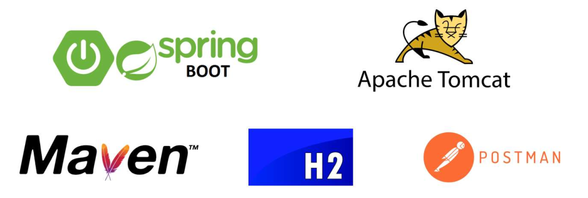
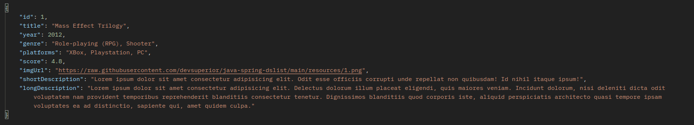
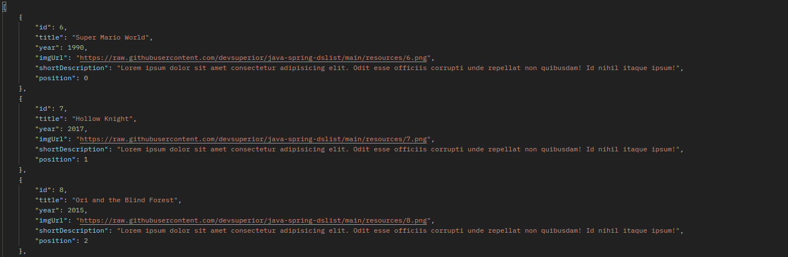

# API para serviço de usuários e pedidos
[](https://github.com/SamuelLost/springboot-project/blob/master/LICENSE) 

# Sobre o projeto
O DSList é uma API RESTful construída durante o Bootcamp da DevSuperior, com o objetivo de gerenciar jogos e categorias.
Com ela é possível cadastrar uma lista de jogos e uma espécie de ranking de jogos, onde é possível adicionar, remover e atualizar jogos e categorias. Além disso, os jogos contém uma imagem, um score, a plataforma em que o jogo está disponível e a data de lançamento e o gênero do jogo. 

Em resumo, a ideia é que o usuário crie uma lista e adicione os jogos ele já jogou, suas informações e sua nota. Formando assim uma espécia de ranking pessoal de jogos.

# Deploy
O projeto está disponível no Railway, um serviço de deploy gratuito para aplicações Spring Boot. Para acessar a aplicação, basta clicar no link: [dslist-production-8486.up.railway.app](dslist-production-8486.up.railway.app). 

Ele utiliza a esteira de CI/CD do Railway, que é integrada com o GitHub. Assim, a cada push no repositório, o Railway faz o build e o deploy da aplicação automaticamente.

# Tecnologias utilizadas
## Back end
- Java
- Spring Boot
- JPA / Hibernate
- Maven
- Banco de dados: H2 Database

## Outras tecnologias
- Docker
- Railway (Deploy)


## Requisições para API
- Postman



## Modelo de Requisições
### Endpoints

- GET /api/games

- GET /api/games/{id}

- POST /api/games: TODO

- PUT /api/games/{id}: TODO

- DELETE /api/games/{id}: TODO

- GET /api/lists

- GET /api/lists/{id}

- POST /lists/{id}/replacement - Endpoint para alterar o ranking de um jogo

### Exemplo de requisição - GET /api/games/{id}



### Exemplo de requisição - GET  /api/lists/{id}



## Modelo Relacional do DSList


# Como executar o projeto

## Back end
Pré-requisitos: Java 17

```bash
# Clonar o repositório
git clone https://github.com/SamuelLost/dslist.git

# Entrar na pasta do projeto
cd dslist/backend

# Executar o projeto
./mvnw spring-boot:run
```

# Futuras modificações
Fazer a integração com o front-end, utilizando o React ou Angular. Além disso, adicionar novas funcionalidades e completar os endpoints que estão faltando.

# Autor

Samuel Henrique Guimarães Alencar

https://www.linkedin.com/in/samuelhenrique15
